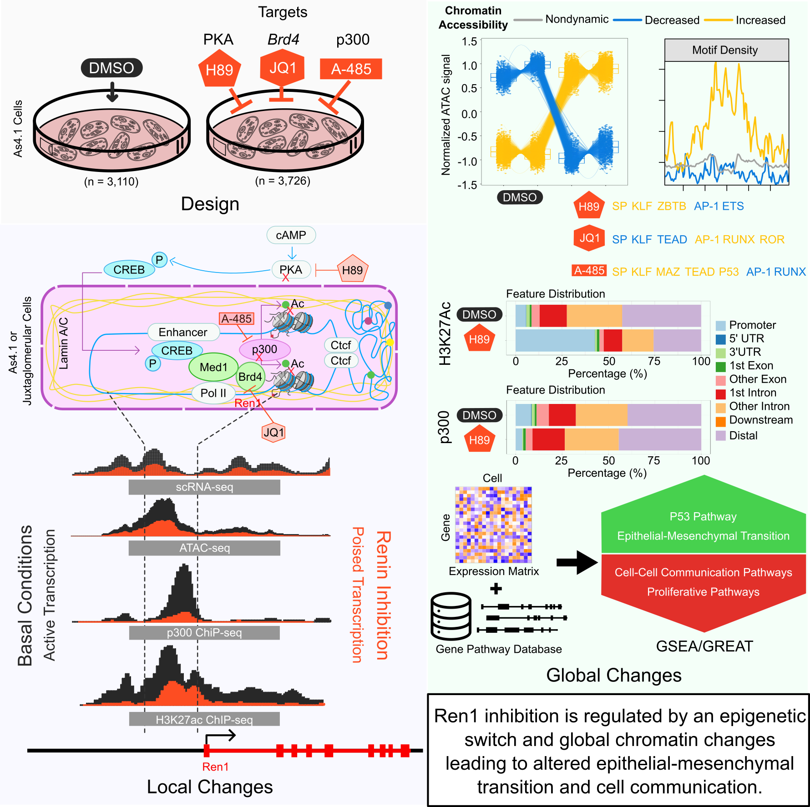

# Epigenetic Switch Regulates Renin Expression

Here we provide step-by-step procedures to analyze the data presented in "Inhibition of Renin Expression is Regulated by an Epigenetic Switch from an Active to a Poised State".

| {: style="height:550px;width:550px"} |
|:--:|
| **Inhibition of Renin Yields Local Epigenetic Modifications and Global Chromatin Changes**. As4.1 cells were treated with either a control compound (DMSO) or a treatment to inhibit a component of renin regulation including: PKA (H89), *Brd4* (JQ1), and p300/CBP (A-485). Under inhibition, chromatin at the *Ren1* locus remains open, but the loss of H3K27ac and p300 binding occurs at the locus and globally. Genome-wide, clusters of dynamically accessible chromatin were identified across inhibitory treatments with shared enrichment of the same transcription factor family motifs. Between differentially accessible chromatin and gene expression sets, inhibition of renin led to increases in EMT and P53 activation with concomittant losses in proliferative and cell-cell communication pathways highlighting the capability of renin-expressing cells to alternate between endocrine and contractile phenotypes. |

